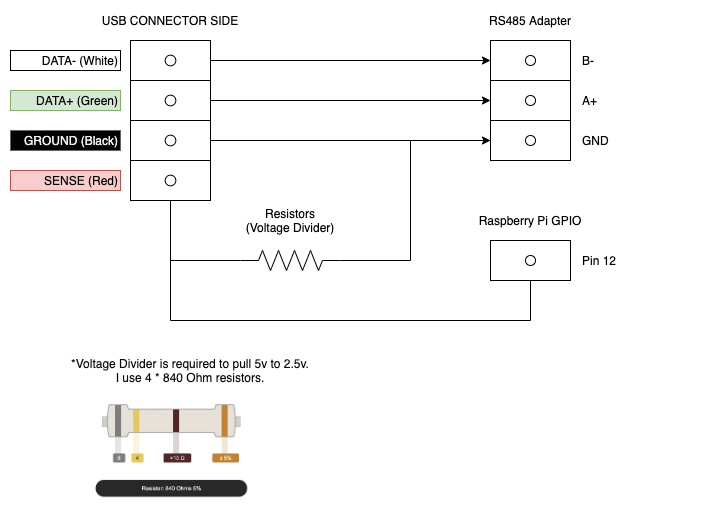

# MOVED AGAIN, SORRY!

Now being developed over at: https://github.com/openjvs/openjvs

New version with better mapping support!

---

# OpenJVS3
[](https://github.com/bobbydilley/OpenJVS3/actions?query=branch%3Amaster)

This is a completely new version of OpenJVS built from the JVSCore project. The aim of this revision of the software is to be stable on all hardware and linux distributions, and built in a maintainable way. OpenJVS aims to be a drop in replacement for any sort of IO board, and currently supports the following hardware:

- Sega Naomi
- Sega Naomi 2
- Sega Triforce
- Sega Chihiro
- Sega Lindbergh

The following hardware is **currently not supported**, however we are working to fix the issues.

- Sega Ringedge

## Installation

The software is tested to work work on a Raspian Linux running on a Raspberry Pi 2 and above. Ubuntu linux is known to work as well.

To install OpenJVS3 follow the instructions below to install the required packages and make the program.

```
sudo apt install git build-essential cmake
git clone https://github.com/bobbydilley/OpenJVS3
cd OpenJVS3
./build.sh
dpkg --install build/*.deb
```

Please note when installing the package again, any settings files you have modified will be overwritten. Map/Device files that you have __added__ your self will remain safe.

## Sense Circuit

For anything other than the Sega Naomi 1 you need to wire a Sense circuit like the one seen below:



## Usage

OpenJVS3 can be run from the command line by typing the executable name.

```
sudo openjvs
```

## Setup

Settings files are located in `/etc/openjvs/` which contains the global config file and both mapping from USB devices to OpenJVS and OpenJVS to Arcade Hardware.
